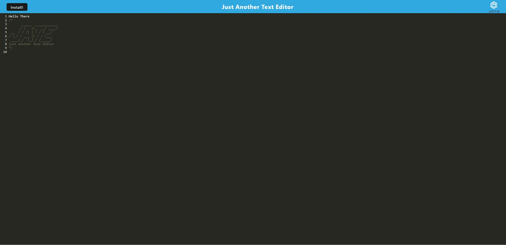
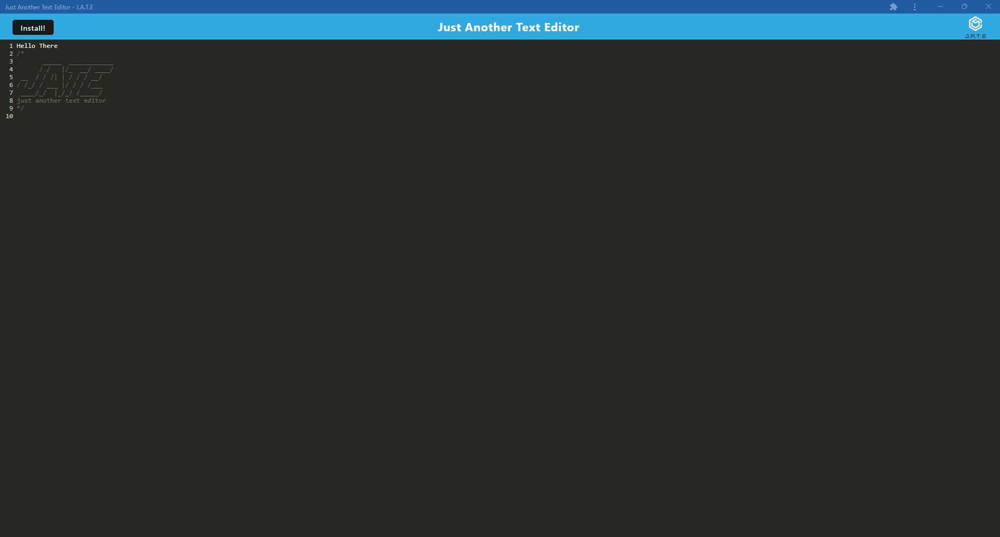

# Pwa-Proof
## To show online and offline functionality 
### Table of Contents
- [Project Discription](#Discription)
- [Useage](#Useage)
- [Installation](#Installation)
- [Contributions](#Constributions)
- [Licence](#Licence)
- [Email](#Questions)
- [github](#Questions)

## Discription
This program can be used both on and offline

## Useage 
This program is used to take notes both online and offline

## Installation
using npm install should give you all the dependencies needed to run the app

## Contributions 
I am the main contributor.

## Licence 

## Questions 
For any further questions that are not addressed in  this README please find my email and github below

### email: jbbalshaw@gmail.com
### github: 

## ScreenShots

